# Architecture Documentation

Complete system architecture for the Child Reward System, including component diagrams, data flow, authentication, and deployment architecture.

---

## Table of Contents

1. [System Overview](#system-overview)
2. [High-Level Architecture](#high-level-architecture)
3. [Component Architecture](#component-architecture)
4. [Data Flow](#data-flow)
5. [Authentication Flow](#authentication-flow)
6. [Feature Workflows](#feature-workflows)
7. [Database Architecture](#database-architecture)
8. [Deployment Architecture](#deployment-architecture)
9. [Technology Stack](#technology-stack)

---

## System Overview

The Child Reward System is a **Next.js 15** full-stack application with **Supabase** backend, built as a **Progressive Web App (PWA)** for families to track children's behavior and manage dual-track rewards (screen time + savings goal).

### Architecture Principles:
- **Multi-tenancy:** Complete data isolation per family via RLS
- **Role-based access:** Parent (admin) vs Child (read-only)
- **Server-side rendering:** Next.js App Router with RSC
- **Real-time data:** Supabase Realtime (future)
- **Offline-first:** Service Worker for PWA
- **Type-safe:** TypeScript throughout

---

## High-Level Architecture

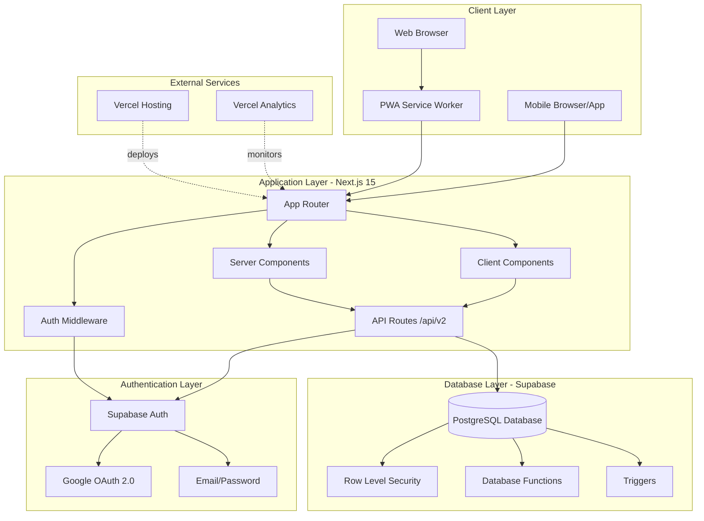

---

## Component Architecture

### Frontend Component Hierarchy

```mermaid
graph TD
    RootLayout[app/layout.tsx<br/>Root Layout]
    AuthProvider[AuthProvider Context]
    Navigation[Navigation Component]
    
    RootLayout --> AuthProvider
    RootLayout --> Navigation
    
    subgraph "Pages"
        Dashboard[Dashboard Page<br/>app/page.tsx]
        Tracking[Tracking Page<br/>app/tracking/page.tsx]
        Weekly[Weekly Page<br/>app/weekly/page.tsx]
        Children[Children Page<br/>app/children/page.tsx]
        Config[Config Page<br/>app/config/page.tsx]
    end
    
    AuthProvider --> Dashboard
    AuthProvider --> Tracking
    AuthProvider --> Weekly
    AuthProvider --> Children
    AuthProvider --> Config
    
    Navigation -.links.-> Dashboard
    Navigation -.links.-> Tracking
    Navigation -.links.-> Weekly
    Navigation -.links.-> Children
    Navigation -.links.-> Config
    
    subgraph "Shared Components"
        ChildSelector[Child Selector]
        Charts[Charts - Recharts]
        UI[UI Components<br/>Button, Card, Input]
        EmojiPicker[Emoji Picker]
        PageHeader[Page Header]
    end
    
    Dashboard --> ChildSelector
    Dashboard --> Charts
    Tracking --> ChildSelector
    Tracking --> EmojiPicker
    Weekly --> ChildSelector
    Weekly --> Charts
    Children --> UI
    Config --> EmojiPicker
    Config --> UI
    
    subgraph "API Routes V2"
        DashAPI[/api/v2/dashboard]
        TrackAPI[/api/v2/tracking]
        WeeklyAPI[/api/v2/weekly]
        ConfigAPI[/api/v2/config]
        CatAPI[/api/v2/categories]
        BonusAPI[/api/v2/bonuses]
        DedAPI[/api/v2/deductions]
        InitAPI[/api/v2/initialize]
    end
    
    Dashboard --> DashAPI
    Tracking --> TrackAPI
    Weekly --> WeeklyAPI
    Config --> ConfigAPI
    Config --> CatAPI
    Config --> BonusAPI
    Config --> DedAPI
```

### API Route Architecture

```mermaid
graph LR
    subgraph "V2 API Routes"
        Dashboard[/api/v2/dashboard<br/>GET: Aggregated analytics]
        Tracking[/api/v2/tracking<br/>GET, POST, PUT]
        Weekly[/api/v2/weekly<br/>GET: Weekly summaries]
        Config[/api/v2/config<br/>GET, PUT]
        Categories[/api/v2/categories<br/>GET, POST, PUT, DELETE]
        Bonuses[/api/v2/bonuses<br/>GET, POST, PUT, DELETE]
        Deductions[/api/v2/deductions<br/>GET, POST, PUT, DELETE]
        Initialize[/api/v2/initialize<br/>POST: Family setup]
    end
    
    subgraph "V1 Legacy"
        Children[/api/children<br/>GET, POST, PUT, DELETE]
    end
    
    Dashboard --> Supabase
    Tracking --> Supabase
    Weekly --> Supabase
    Config --> Supabase
    Categories --> Supabase
    Bonuses --> Supabase
    Deductions --> Supabase
    Initialize --> Supabase
    Children --> Supabase
    
    Supabase[(Supabase PostgreSQL)]
```

---

## Data Flow

### Daily Tracking Data Flow

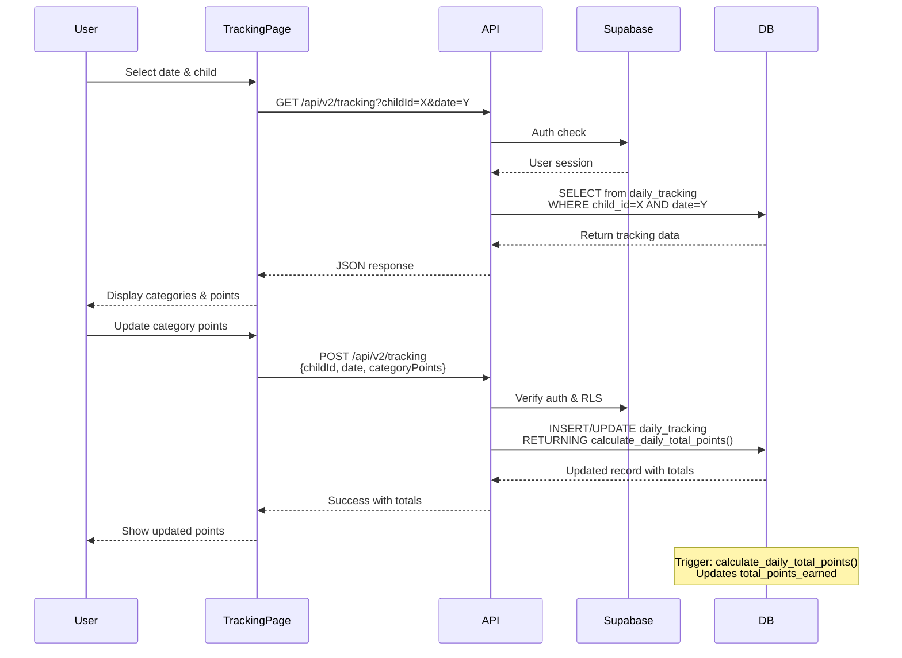

### Dashboard Aggregation Flow

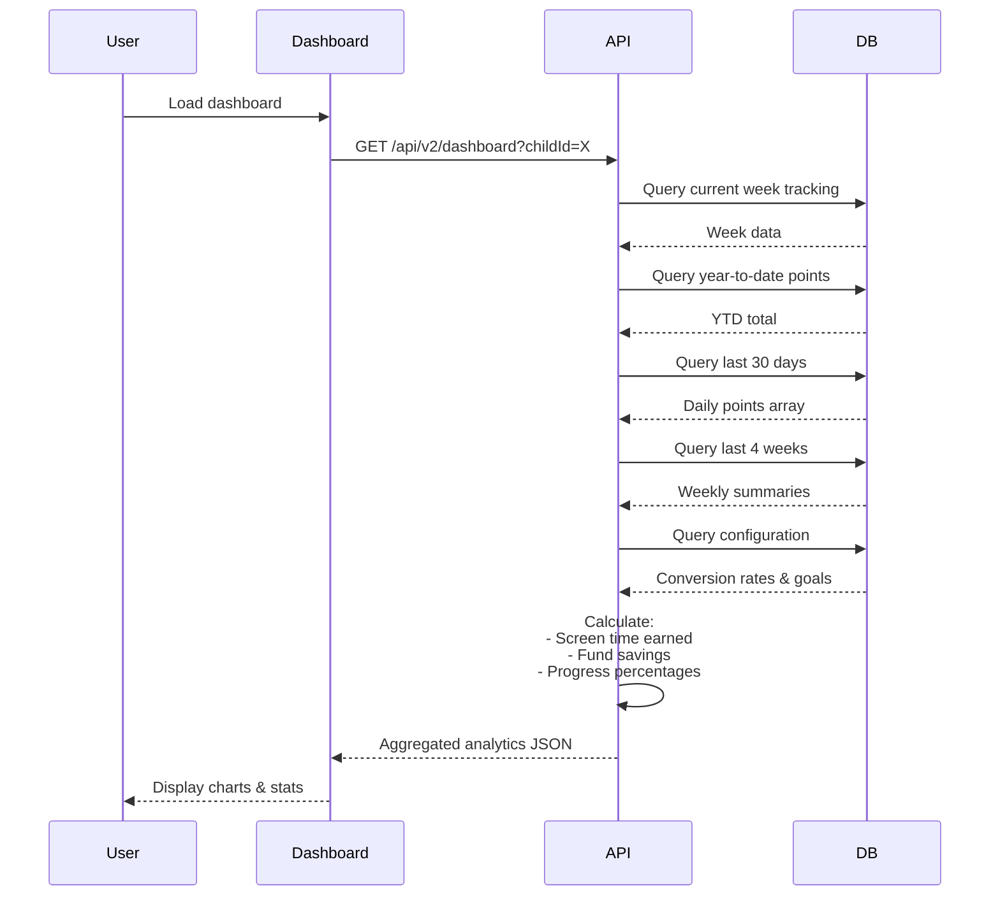

### Weekly Summary Calculation

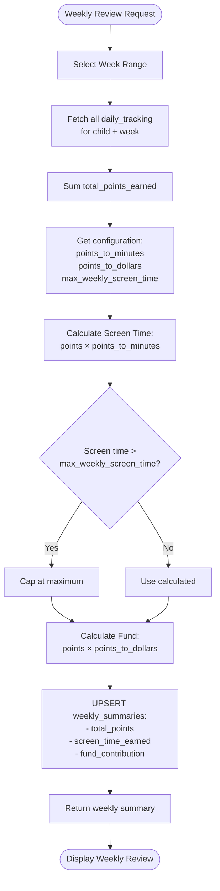

---

## Authentication Flow

### Parent Signup & Family Initialization

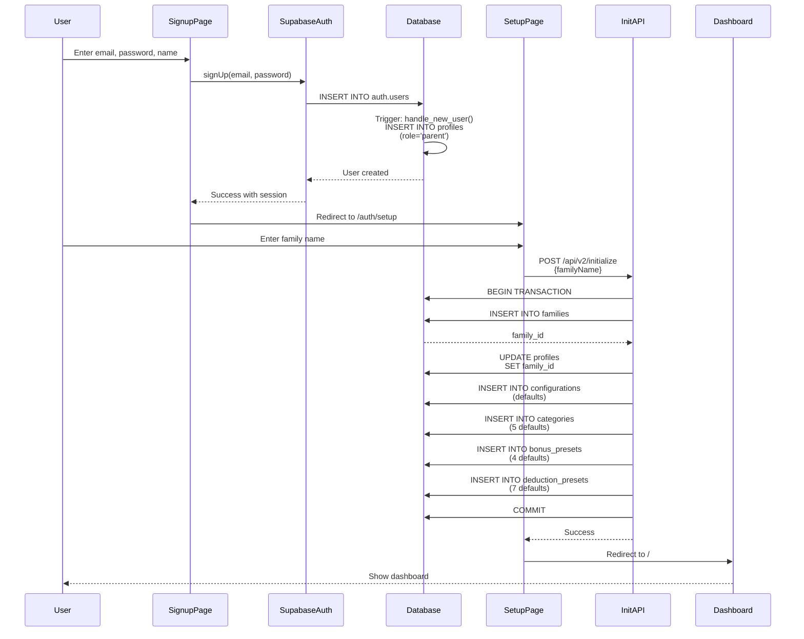

### Google OAuth Flow

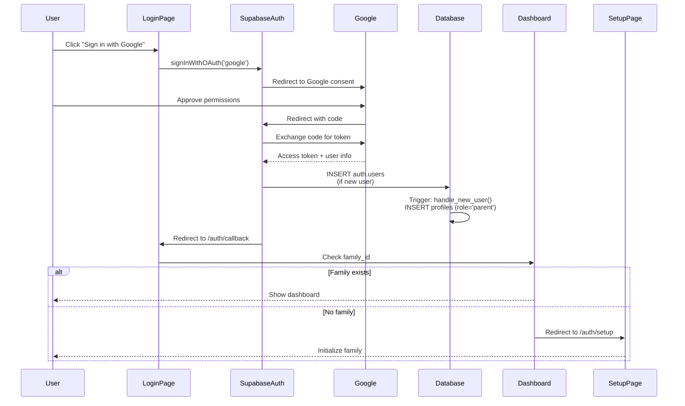

### Child Login Flow

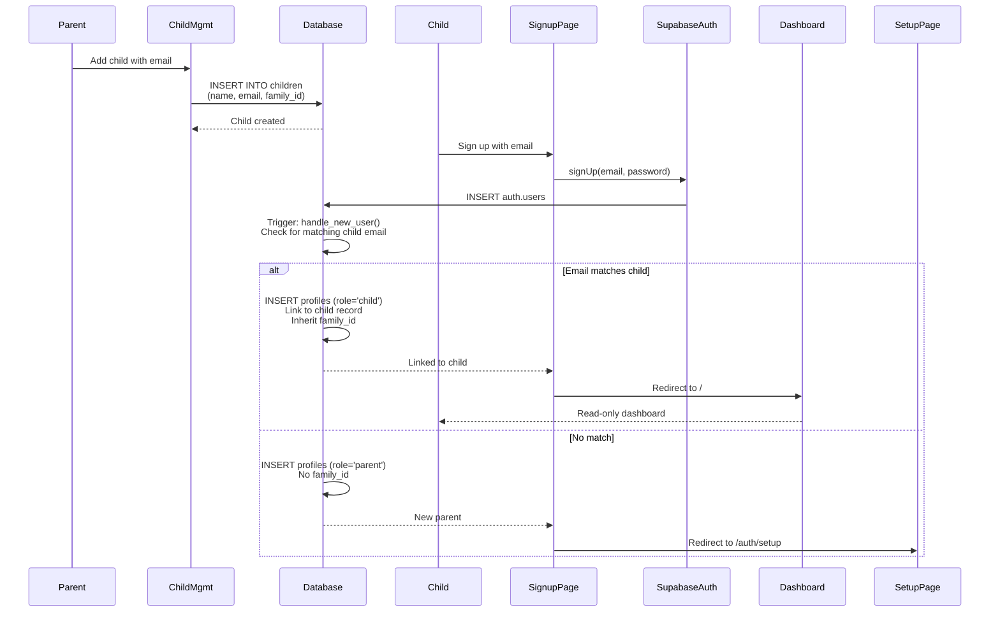

### Session Management & Middleware

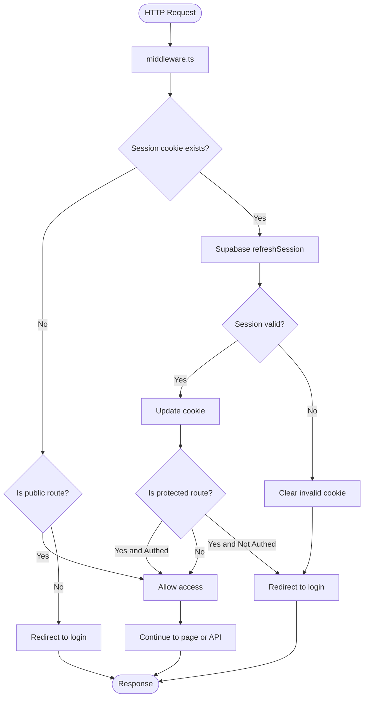

---

## Feature Workflows

### Complete Daily Tracking Workflow

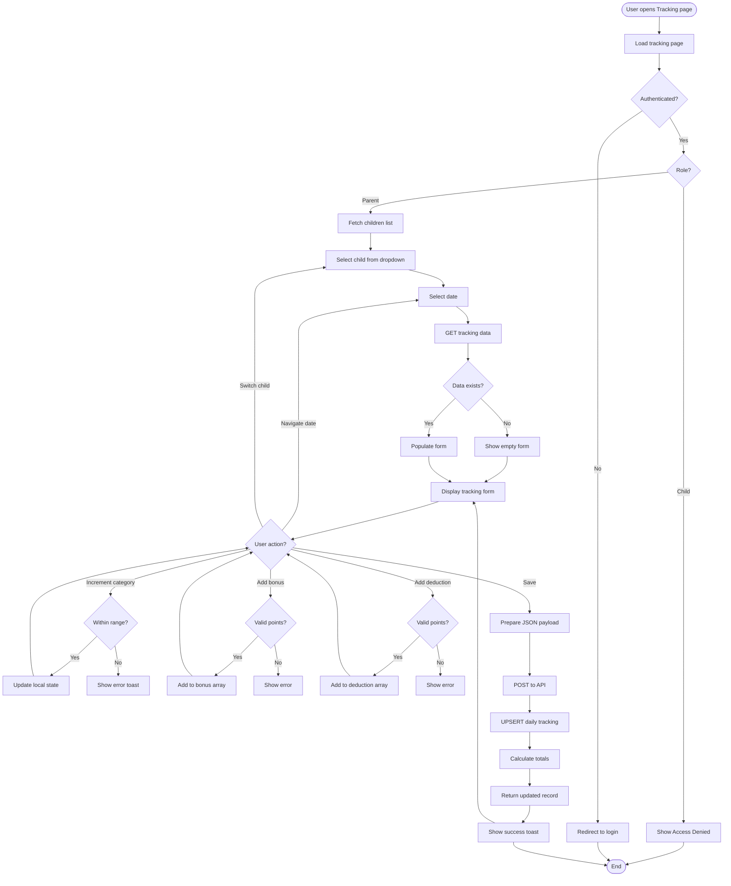

### Weekly Review Workflow

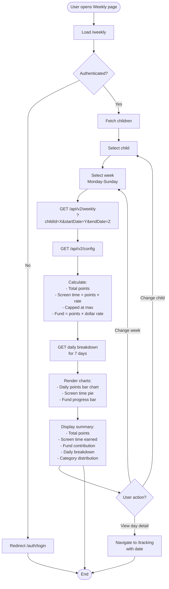

### Configuration Update Workflow

```mermaid
flowchart TD
    Start([User opens Config page]) --> LoadPage[Load /config]
    LoadPage --> Auth{Authenticated<br/>& Parent?}
    Auth -->|No| Deny[Show "Access Denied"]
    Auth -->|Yes| LoadConfig[GET /api/v2/config]
    
    LoadConfig --> LoadCategories[GET /api/v2/categories]
    LoadCategories --> LoadBonuses[GET /api/v2/bonuses]
    LoadBonuses --> LoadDeductions[GET /api/v2/deductions]
    LoadDeductions --> RenderTabs[Render tabs:<br/>General, Categories,<br/>Bonuses, Deductions]
    
    RenderTabs --> UserAction{User action?}
    
    UserAction -->|Update general| ValidateGeneral{Valid ranges?}
    ValidateGeneral -->|Yes| SaveGeneral[PUT /api/v2/config]
    ValidateGeneral -->|No| ErrorGeneral[Show validation error]
    SaveGeneral --> Success1[Show success]
    Success1 --> RenderTabs
    
    UserAction -->|Add category| ValidateCat{Valid data?}
    ValidateCat -->|Yes| SaveCat[POST /api/v2/categories]
    ValidateCat -->|No| ErrorCat[Show error]
    SaveCat --> ReloadCat[Reload categories]
    ReloadCat --> RenderTabs
    
    UserAction -->|Edit category| SaveEditCat[PUT /api/v2/categories/:id]
    SaveEditCat --> ReloadCat
    
    UserAction -->|Delete category| ConfirmDel{Confirm?}
    ConfirmDel -->|Yes| DeleteCat[DELETE /api/v2/categories/:id]
    ConfirmDel -->|No| RenderTabs
    DeleteCat --> ReloadCat
    
    UserAction -->|Manage bonus| SaveBonus[POST/PUT/DELETE<br/>/api/v2/bonuses]
    SaveBonus --> ReloadBonus[Reload bonuses]
    ReloadBonus --> RenderTabs
    
    UserAction -->|Manage deduction| SaveDed[POST/PUT/DELETE<br/>/api/v2/deductions]
    SaveDed --> ReloadDed[Reload deductions]
    ReloadDed --> RenderTabs
    
    Deny --> End([End])
    RenderTabs --> End
```

---

## Database Architecture

### Schema Relationships (from DATABASE.md)

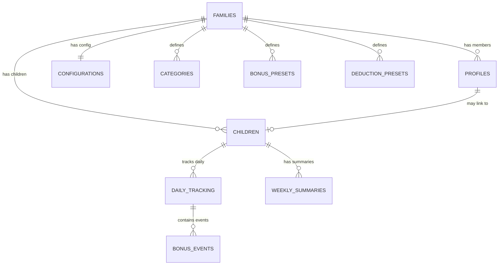

### Row Level Security (RLS) Flow

```mermaid
flowchart TD
    Query([SQL Query]) --> RLS{RLS Policy Check}
    
    RLS --> GetUser[Get authenticated user<br/>auth.uid()]
    GetUser --> GetFamily[get_user_family_id()<br/>Returns user's family_id]
    
    GetFamily --> CheckRole{Check role}
    CheckRole -->|Parent| ParentCheck[is_parent() = true<br/>Can access all family data]
    CheckRole -->|Child| ChildCheck[child_in_family()<br/>Can only access own data]
    
    ParentCheck --> FilterFamily[Filter by family_id]
    ChildCheck --> FilterChild[Filter by family_id<br/>AND child_id = linked_profile_id]
    
    FilterFamily --> ExecuteQuery[Execute filtered query]
    FilterChild --> ExecuteQuery
    
    ExecuteQuery --> Return[Return results]
    
    RLS -->|No auth| Deny[Return empty set]
    Deny --> Return
```

### Database Function Flow

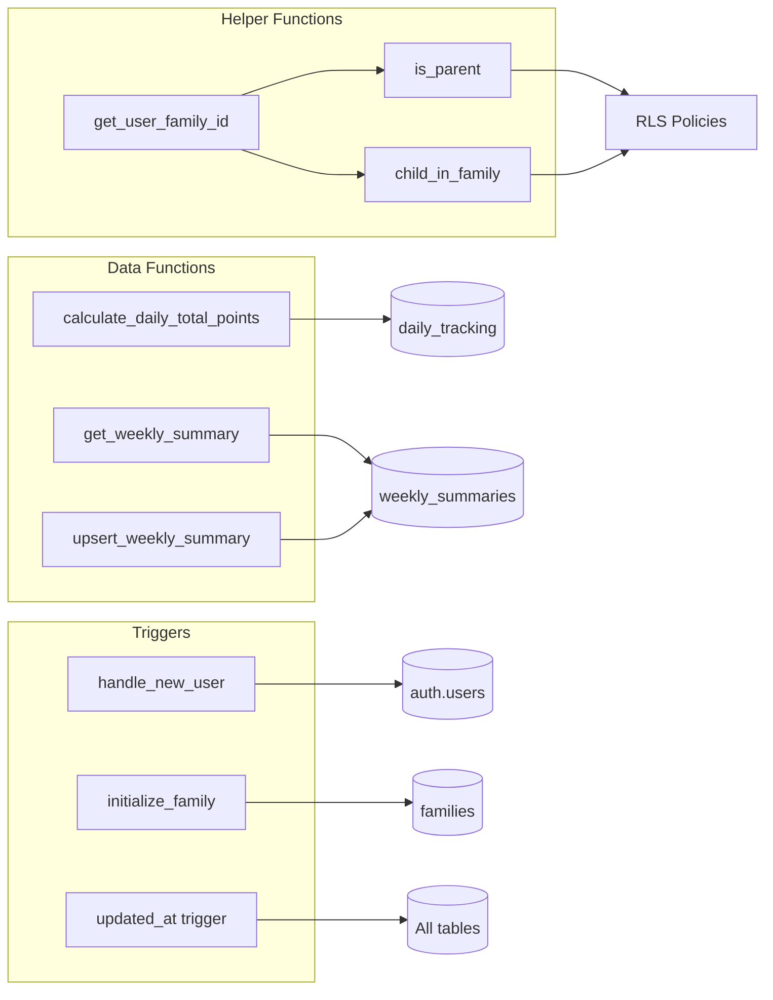

---

## Deployment Architecture

### Production Deployment (Vercel + Supabase)

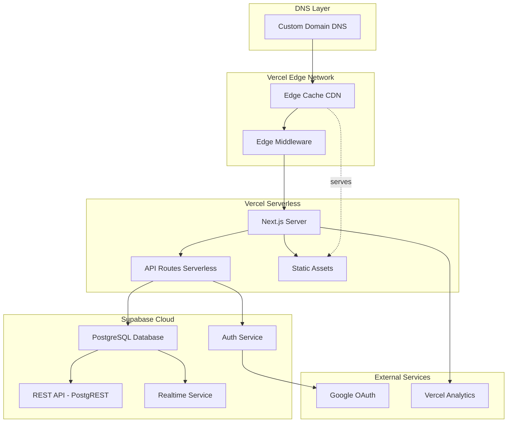

### Development vs Production

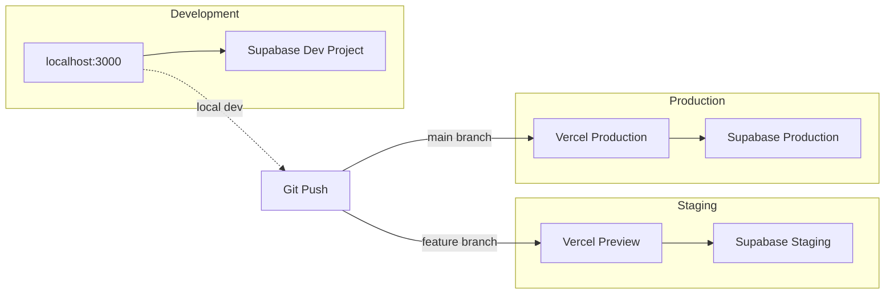

### CI/CD Pipeline

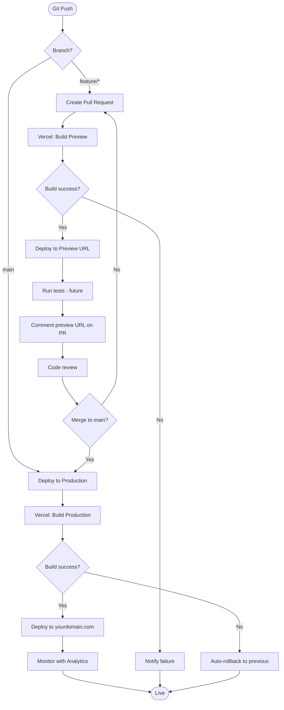

---

## Technology Stack

### Frontend Stack

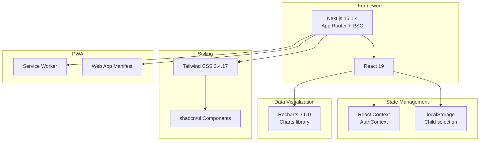

### Backend Stack

```mermaid
graph TD
    subgraph "Backend Framework"
        API[Next.js API Routes<br/>Serverless Functions]
    end
    
    subgraph "Database"
        Supabase[Supabase]
        PostgreSQL[(PostgreSQL 15)]
        RLS[Row Level Security]
    end
    
    subgraph "Authentication"
        SupabaseAuth[Supabase Auth]
        Google[Google OAuth 2.0]
        Email[Email/Password]
    end
    
    subgraph "TypeScript"
        Types[Generated Types<br/>types/supabase.ts]
    end
    
    API --> Supabase
    Supabase --> PostgreSQL
    PostgreSQL --> RLS
    Supabase --> SupabaseAuth
    SupabaseAuth --> Google
    SupabaseAuth --> Email
    Supabase --> Types
```

### Development Tools

```mermaid
graph LR
    subgraph "Development"
        VSCode[VS Code]
        ESLint[ESLint]
        Prettier[Prettier - future]
        TypeScript[TypeScript 5.x]
    end
    
    subgraph "Build Tools"
        Turbopack[Turbopack<br/>Dev server]
        PostCSS[PostCSS]
    end
    
    subgraph "Deployment"
        Vercel[Vercel CLI]
        Git[Git/GitHub]
    end
    
    VSCode --> ESLint
    VSCode --> TypeScript
    TypeScript --> Turbopack
    Turbopack --> PostCSS
    Git --> Vercel
```

---

## Performance Considerations

### Optimization Strategies

```mermaid
flowchart TD
    Request([User Request]) --> Cache{Cached?}
    
    Cache -->|Yes| ServeCache[Serve from Edge Cache]
    Cache -->|No| SSR{Server render?}
    
    SSR -->|Yes| ServerRender[Server Component Render]
    SSR -->|No| ClientRender[Client Component Render]
    
    ServerRender --> FetchData[Fetch from Supabase]
    ClientRender --> FetchData
    
    FetchData --> DBOptimize{Optimized?}
    DBOptimize -->|Yes| FastQuery[Use indexes<br/>RLS optimized]
    DBOptimize -->|No| SlowQuery[Full table scan]
    
    FastQuery --> Return[Return data]
    SlowQuery --> Return
    
    Return --> CacheResponse[Cache static assets]
    CacheResponse --> Deliver[Deliver to client]
    
    ServeCache --> Deliver
    Deliver --> End([Response])
```

### Database Optimization

- **Indexes:** On family_id, child_id, date columns
- **RLS:** Optimized policies with function inlining
- **JSONB:** Efficient storage for category_points
- **Connection pooling:** Supabase manages pool
- **Prepared statements:** All queries parameterized

---

## Security Architecture

### Security Layers

```mermaid
flowchart TD
    Request([Client Request]) --> HTTPS{HTTPS?}
    HTTPS -->|No| Reject[Reject connection]
    HTTPS -->|Yes| Cookie{Valid cookie?}
    
    Cookie -->|No| Public{Public route?}
    Public -->|Yes| Allow[Allow access]
    Public -->|No| Redirect[Redirect to login]
    
    Cookie -->|Yes| ValidateSession[Validate session<br/>with Supabase]
    ValidateSession --> SessionValid{Valid?}
    
    SessionValid -->|No| ClearCookie[Clear cookie + redirect]
    SessionValid -->|Yes| CheckRLS[Check RLS policies]
    
    CheckRLS --> FamilyCheck{Belongs to family?}
    FamilyCheck -->|No| Deny[Return 403]
    FamilyCheck -->|Yes| RoleCheck{Has permission?}
    
    RoleCheck -->|No| Deny
    RoleCheck -->|Yes| Execute[Execute query]
    
    Execute --> Sanitize[Sanitize output]
    Sanitize --> Return[Return response]
    
    Reject --> End([End])
    Redirect --> End
    ClearCookie --> End
    Deny --> End
    Return --> End
    Allow --> End
```

---

## Future Architecture Enhancements

### Planned Improvements

1. **Real-time Sync:**
   ```mermaid
   graph LR
   Client1[Parent Device] --> Supabase[Supabase Realtime]
   Client2[Child Device] --> Supabase
   Supabase -.broadcast.-> Client1
   Supabase -.broadcast.-> Client2
   ```

2. **Caching Layer:**
   - Redis for API responses
   - Edge caching for static content
   - Service Worker for offline

3. **Microservices:**
   - Notification service (email/SMS)
   - Export service (PDF/CSV)
   - Analytics service

4. **Mobile Apps:**
   - React Native apps
   - Native database sync
   - Push notifications

---

**Architecture Version:** 1.0  
**Last Updated:** January 5, 2026  
**Related:** [Features](./FEATURES.md) | [Database](./DATABASE.md) | [API](./API.md) | [Deployment](./DEPLOYMENT.md)
