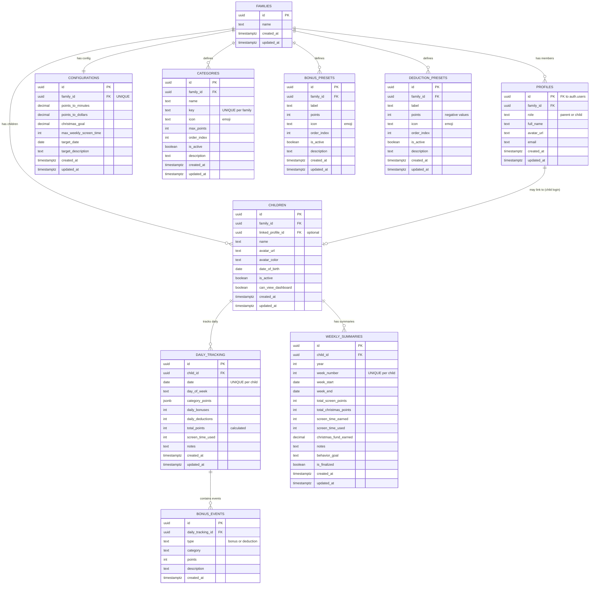

# Database Schema Documentation

## Overview

The Child Reward System uses **PostgreSQL** (via Supabase) as its primary database. The schema is designed with multi-tenancy in mind, where each family operates in complete isolation using Row Level Security (RLS) policies.

## Database Architecture



## Tables

### 1. families
**Purpose**: Top-level tenant entity representing a family unit

| Column | Type | Constraints | Description |
|--------|------|-------------|-------------|
| id | UUID | PK, DEFAULT uuid_generate_v4() | Unique family identifier |
| name | TEXT | NOT NULL | Family display name |
| created_at | TIMESTAMPTZ | DEFAULT NOW() | Creation timestamp |
| updated_at | TIMESTAMPTZ | DEFAULT NOW() | Last update timestamp |

**Indexes**: None (small table)

**RLS Policies**:
- Users can view their own family
- Parents can update their own family

---

### 2. profiles
**Purpose**: Extends Supabase `auth.users` with application-specific data

| Column | Type | Constraints | Description |
|--------|------|-------------|-------------|
| id | UUID | PK, FK → auth.users(id) ON DELETE CASCADE | User ID from Supabase Auth |
| family_id | UUID | FK → families(id) ON DELETE SET NULL | Associated family |
| role | TEXT | NOT NULL, CHECK (role IN ('parent', 'child')) | User role |
| full_name | TEXT | | User's full name |
| avatar_url | TEXT | | Profile picture URL |
| email | TEXT | | Email address |
| created_at | TIMESTAMPTZ | DEFAULT NOW() | Creation timestamp |
| updated_at | TIMESTAMPTZ | DEFAULT NOW() | Last update timestamp |

**Indexes**:
- `idx_profiles_family` on `family_id`

**RLS Policies**:
- Users can view/update own profile
- Parents can view all profiles in their family

**Trigger**: `on_auth_user_created` - Automatically creates profile when user signs up

---

### 3. children
**Purpose**: Trackable children within a family

| Column | Type | Constraints | Description |
|--------|------|-------------|-------------|
| id | UUID | PK, DEFAULT uuid_generate_v4() | Child identifier |
| family_id | UUID | NOT NULL, FK → families(id) ON DELETE CASCADE | Parent family |
| linked_profile_id | UUID | FK → profiles(id) ON DELETE SET NULL | Optional link for child login |
| name | TEXT | NOT NULL | Child's name |
| avatar_url | TEXT | | Optional avatar image URL |
| avatar_color | TEXT | DEFAULT '#3b82f6' | Avatar background color (hex) |
| date_of_birth | DATE | | Optional date of birth |
| is_active | BOOLEAN | DEFAULT true | Active status (soft delete) |
| can_view_dashboard | BOOLEAN | DEFAULT false | Permission to view own data |
| created_at | TIMESTAMPTZ | DEFAULT NOW() | Creation timestamp |
| updated_at | TIMESTAMPTZ | DEFAULT NOW() | Last update timestamp |

**Indexes**:
- `idx_children_family` on `family_id`

**RLS Policies**:
- Parents can manage (CRUD) children in their family
- Children can view themselves if `linked_profile_id` matches and `can_view_dashboard` is true

---

### 4. configurations
**Purpose**: Per-family system settings

| Column | Type | Constraints | Description |
|--------|------|-------------|-------------|
| id | UUID | PK, DEFAULT uuid_generate_v4() | Configuration ID |
| family_id | UUID | NOT NULL, FK → families(id) ON DELETE CASCADE, UNIQUE | One config per family |
| points_to_minutes | DECIMAL(10,2) | DEFAULT 0.5 | Screen time conversion rate |
| points_to_dollars | DECIMAL(10,2) | DEFAULT 1.0 | Fund conversion rate |
| christmas_goal | DECIMAL(10,2) | DEFAULT 500.0 | Target fund goal amount |
| max_weekly_screen_time | INT | DEFAULT 60 | Max screen time cap (minutes) |
| target_date | DATE | DEFAULT '2025-12-25' | Target goal deadline |
| target_description | TEXT | DEFAULT 'Christmas Fund' | Custom goal label |
| created_at | TIMESTAMPTZ | DEFAULT NOW() | Creation timestamp |
| updated_at | TIMESTAMPTZ | DEFAULT NOW() | Last update timestamp |

**Indexes**: None needed (one per family)

**RLS Policies**:
- Family members can view config
- Parents can manage (CRUD) config

---

### 5. categories
**Purpose**: Customizable point-earning categories per family

| Column | Type | Constraints | Description |
|--------|------|-------------|-------------|
| id | UUID | PK, DEFAULT uuid_generate_v4() | Category ID |
| family_id | UUID | NOT NULL, FK → families(id) ON DELETE CASCADE | Parent family |
| name | TEXT | NOT NULL | Display name (e.g., "Health & Nutrition") |
| key | TEXT | NOT NULL, UNIQUE(family_id, key) | Unique identifier (e.g., "healthNutrition") |
| icon | TEXT | NOT NULL | Emoji icon |
| max_points | INT | NOT NULL | Maximum points for this category |
| order_index | INT | DEFAULT 0 | Display order |
| is_active | BOOLEAN | DEFAULT true | Active status (soft delete) |
| description | TEXT | | Optional description |
| created_at | TIMESTAMPTZ | DEFAULT NOW() | Creation timestamp |
| updated_at | TIMESTAMPTZ | DEFAULT NOW() | Last update timestamp |

**Indexes**:
- `idx_categories_family` on `family_id`

**RLS Policies**:
- Family members can view categories
- Parents can manage (CRUD) categories

**Default Values** (created by `initialize_family()`):
1. Health & Nutrition (🥗, max 3 pts)
2. Screen Discipline (📱, max 2 pts)
3. Self-Study & Learning (📚, max 2 pts)
4. Household Contribution (🏠, max 3 pts)
5. Behavior & Respect (⭐, max 2 pts)

---

### 6. bonus_presets
**Purpose**: Quick-add bonus options for positive behaviors

| Column | Type | Constraints | Description |
|--------|------|-------------|-------------|
| id | UUID | PK, DEFAULT uuid_generate_v4() | Preset ID |
| family_id | UUID | NOT NULL, FK → families(id) ON DELETE CASCADE | Parent family |
| label | TEXT | NOT NULL | Bonus description |
| points | INT | NOT NULL | Positive point value |
| icon | TEXT | | Emoji icon |
| order_index | INT | DEFAULT 0 | Display order |
| is_active | BOOLEAN | DEFAULT true | Active status (soft delete) |
| description | TEXT | | Optional detailed description |
| created_at | TIMESTAMPTZ | DEFAULT NOW() | Creation timestamp |
| updated_at | TIMESTAMPTZ | DEFAULT NOW() | Last update timestamp |

**Indexes**:
- `idx_bonus_presets_family` on `family_id`

**RLS Policies**:
- Family members can view bonus presets
- Parents can manage (CRUD) bonus presets

**Default Values**:
- Perfect sugar-free day (+2 pts)
- Extraordinary helpfulness (+3 pts)
- Homework ahead of schedule (+2 pts)
- Helped sibling/peer (+2 pts)

---

### 7. deduction_presets
**Purpose**: Quick-add deduction options for negative behaviors

| Column | Type | Constraints | Description |
|--------|------|-------------|-------------|
| id | UUID | PK, DEFAULT uuid_generate_v4() | Preset ID |
| family_id | UUID | NOT NULL, FK → families(id) ON DELETE CASCADE | Parent family |
| label | TEXT | NOT NULL | Deduction description |
| points | INT | NOT NULL | **Negative** point value |
| icon | TEXT | | Emoji icon |
| order_index | INT | DEFAULT 0 | Display order |
| is_active | BOOLEAN | DEFAULT true | Active status (soft delete) |
| description | TEXT | | Optional detailed description |
| created_at | TIMESTAMPTZ | DEFAULT NOW() | Creation timestamp |
| updated_at | TIMESTAMPTZ | DEFAULT NOW() | Last update timestamp |

**Indexes**:
- `idx_deduction_presets_family` on `family_id`

**RLS Policies**:
- Family members can view deduction presets
- Parents can manage (CRUD) deduction presets

**Default Values**:
- Disrespectful behavior (-2 pts)
- Refused chore (-3 pts)
- Lied about something (-5 pts)
- Physical aggression (-5 pts)
- Sneaking screen time (-5 pts)
- Morning routine not completed (-1 pt)
- Tantrum/meltdown (-3 pts)

---

### 8. daily_tracking
**Purpose**: Daily point tracking per child

| Column | Type | Constraints | Description |
|--------|------|-------------|-------------|
| id | UUID | PK, DEFAULT uuid_generate_v4() | Tracking record ID |
| child_id | UUID | NOT NULL, FK → children(id) ON DELETE CASCADE | Child being tracked |
| date | DATE | NOT NULL, UNIQUE(child_id, date) | Tracking date (one per child per day) |
| day_of_week | TEXT | NOT NULL | Day name (Monday, Tuesday, etc.) |
| category_points | JSONB | DEFAULT '{}' | Dynamic category points: `{"healthNutrition": 2, "screenDiscipline": 1, ...}` |
| daily_bonuses | INT | DEFAULT 0 | Sum of bonus points |
| daily_deductions | INT | DEFAULT 0 | Sum of deduction points (negative) |
| total_points | INT | | Calculated: sum(category_points) + daily_bonuses + daily_deductions |
| screen_time_used | INT | | Actual screen time used (minutes) |
| notes | TEXT | | Daily observations |
| created_at | TIMESTAMPTZ | DEFAULT NOW() | Creation timestamp |
| updated_at | TIMESTAMPTZ | DEFAULT NOW() | Last update timestamp |

**Indexes**:
- `idx_daily_tracking_child` on `child_id`
- `idx_daily_tracking_date` on `date`

**RLS Policies**:
- Parents can manage (CRUD) daily tracking for family children
- Children can view their own tracking if `can_view_dashboard` is true

**JSONB Structure** (`category_points`):
```json
{
  "healthNutrition": 2,
  "screenDiscipline": 1,
  "selfStudy": 2,
  "household": 3,
  "behaviorRespect": 2
}
```

---

### 9. bonus_events
**Purpose**: Individual bonus/deduction event details

| Column | Type | Constraints | Description |
|--------|------|-------------|-------------|
| id | UUID | PK, DEFAULT uuid_generate_v4() | Event ID |
| daily_tracking_id | UUID | NOT NULL, FK → daily_tracking(id) ON DELETE CASCADE | Parent tracking record |
| type | TEXT | NOT NULL, CHECK (type IN ('bonus', 'deduction')) | Event type |
| category | TEXT | NOT NULL | Event category/label |
| points | INT | NOT NULL | Point value (positive or negative) |
| description | TEXT | | Optional event description |
| created_at | TIMESTAMPTZ | DEFAULT NOW() | Event timestamp |

**Indexes**:
- `idx_bonus_events_tracking` on `daily_tracking_id`

**RLS Policies**:
- Parents can manage (CRUD) bonus events for family children
- Children can view their own bonus events if `can_view_dashboard` is true

---

### 10. weekly_summaries
**Purpose**: Aggregated weekly performance per child

| Column | Type | Constraints | Description |
|--------|------|-------------|-------------|
| id | UUID | PK, DEFAULT uuid_generate_v4() | Summary ID |
| child_id | UUID | NOT NULL, FK → children(id) ON DELETE CASCADE | Child being summarized |
| year | INT | NOT NULL | Year number |
| week_number | INT | NOT NULL, UNIQUE(child_id, year, week_number) | ISO week number |
| week_start | DATE | NOT NULL | Week start date (Monday) |
| week_end | DATE | NOT NULL | Week end date (Sunday) |
| total_screen_points | INT | DEFAULT 0 | Total points for screen time track |
| total_christmas_points | INT | DEFAULT 0 | Total points for fund track |
| screen_time_earned | INT | DEFAULT 0 | Screen time minutes earned |
| screen_time_used | INT | DEFAULT 0 | Screen time minutes used |
| christmas_fund_earned | DECIMAL(10,2) | DEFAULT 0 | Dollars earned for fund |
| notes | TEXT | | Weekly reflection notes |
| behavior_goal | TEXT | | Goal for next week |
| is_finalized | BOOLEAN | DEFAULT false | Whether week is complete |
| created_at | TIMESTAMPTZ | DEFAULT NOW() | Creation timestamp |
| updated_at | TIMESTAMPTZ | DEFAULT NOW() | Last update timestamp |

**Indexes**:
- `idx_weekly_summaries_child` on `child_id`

**RLS Policies**:
- Parents can manage (CRUD) weekly summaries for family children
- Children can view their own summaries if `can_view_dashboard` is true

---

## Database Functions

### get_user_family_id()
**Purpose**: Helper to get current user's family ID

```sql
CREATE OR REPLACE FUNCTION get_user_family_id()
RETURNS UUID AS $$
  SELECT family_id FROM profiles WHERE id = auth.uid();
$$ LANGUAGE SQL SECURITY DEFINER;
```

**Usage**: Used in RLS policies to scope data to user's family

---

### is_parent()
**Purpose**: Check if current user has parent role

```sql
CREATE OR REPLACE FUNCTION is_parent()
RETURNS BOOLEAN AS $$
  SELECT role = 'parent' FROM profiles WHERE id = auth.uid();
$$ LANGUAGE SQL SECURITY DEFINER;
```

**Usage**: Used in RLS policies to restrict write access to parents

---

### child_in_family(child_uuid UUID)
**Purpose**: Verify child belongs to user's family

```sql
CREATE OR REPLACE FUNCTION child_in_family(child_uuid UUID)
RETURNS BOOLEAN AS $$
  SELECT EXISTS (
    SELECT 1 FROM children c
    WHERE c.id = child_uuid AND c.family_id = get_user_family_id()
  );
$$ LANGUAGE SQL SECURITY DEFINER;
```

**Usage**: Used in RLS policies for child-specific data

---

### handle_new_user()
**Purpose**: Automatically create profile when user signs up

```sql
CREATE OR REPLACE FUNCTION handle_new_user()
RETURNS TRIGGER AS $$
BEGIN
  INSERT INTO profiles (id, email, full_name, role)
  VALUES (
    NEW.id,
    NEW.email,
    COALESCE(NEW.raw_user_meta_data->>'full_name', NEW.email),
    'parent'
  );
  RETURN NEW;
END;
$$ LANGUAGE plpgsql SECURITY DEFINER;
```

**Trigger**: `on_auth_user_created` AFTER INSERT ON `auth.users`

---

### initialize_family(family_name TEXT, user_id UUID)
**Purpose**: Complete family setup with default data

```sql
CREATE OR REPLACE FUNCTION initialize_family(
  family_name TEXT,
  user_id UUID
)
RETURNS UUID -- Returns new family_id
```

**Actions**:
1. Creates family record
2. Links user profile to family
3. Creates default configuration
4. Creates 5 default categories
5. Creates 4 default bonus presets
6. Creates 7 default deduction presets

**Called from**: `/api/v2/initialize` POST endpoint

---

## Triggers

All tables have an `updated_at` trigger that automatically updates the timestamp on UPDATE:

```sql
CREATE TRIGGER tr_<table_name>_updated_at
  BEFORE UPDATE ON <table_name>
  FOR EACH ROW EXECUTE FUNCTION update_updated_at();
```

**Tables with trigger**:
- families
- profiles
- children
- configurations
- categories
- bonus_presets
- deduction_presets
- daily_tracking
- weekly_summaries

---

## Row Level Security (RLS)

All tables have RLS enabled. Security is enforced at the database level using policies.

### Key Principles

1. **Family Isolation**: Users can only access data for their own family
2. **Role-Based**: Parents have full control, children have read-only (if enabled)
3. **Security Definer Functions**: Helper functions run with elevated privileges for policy checks

### Policy Summary

| Table | Parents | Children |
|-------|---------|----------|
| families | View own, Update own | - |
| profiles | View family members, Update own | View own |
| children | Full CRUD | View self if `can_view_dashboard` |
| configurations | Full CRUD | View only |
| categories | Full CRUD | View only |
| bonus_presets | Full CRUD | View only |
| deduction_presets | Full CRUD | View only |
| daily_tracking | Full CRUD | View own if `can_view_dashboard` |
| bonus_events | Full CRUD | View own if `can_view_dashboard` |
| weekly_summaries | Full CRUD | View own if `can_view_dashboard` |

---

## Migrations

Migrations are stored in `supabase/migrations/` directory.

### Applied Migrations

1. **`20260105_add_aggregate_functions.sql`**
   - Adds aggregate functions for dashboard calculations
   
2. **`20260105_fix_weekly_summary_function.sql`**
   - Fixes weekly summary calculation function

3. **`20260105_add_target_date_to_config.sql`**
   - Adds `target_date` and `target_description` to configurations table
   - Allows customizable goal names and dates

### Applying Migrations

```bash
# Via Supabase CLI
supabase db push

# Or manually via SQL Editor in Supabase dashboard
```

---

## Performance Considerations

### Indexes
All foreign keys and frequently queried columns are indexed for optimal performance.

### JSONB Performance
The `category_points` JSONB column allows flexible categories without schema changes. PostgreSQL provides efficient JSONB operations.

**For large scale**: Consider GIN index on `category_points`:
```sql
CREATE INDEX idx_daily_tracking_category_points ON daily_tracking USING GIN (category_points);
```

### Query Optimization
- RLS policies are optimized with helper functions
- Date range queries use indexed columns
- Connection pooling via Supabase Pooler

---

## Backup & Recovery

### Automated Backups
Supabase provides automatic daily backups on Pro tier and above.

### Manual Backup
```bash
# Via pg_dump
pg_dump -h <supabase-host> -U postgres -d postgres > backup.sql

# Restore
psql -h <supabase-host> -U postgres -d postgres < backup.sql
```

---

## Future Enhancements

1. **Partitioning**: Partition `daily_tracking` by date for better performance at scale
2. **Materialized Views**: Create materialized views for dashboard aggregations
3. **Full-text Search**: Add full-text search on notes fields
4. **Audit Logging**: Track all changes for compliance
5. **Data Archiving**: Archive old tracking data after X years

---

**Last Updated**: January 5, 2026
