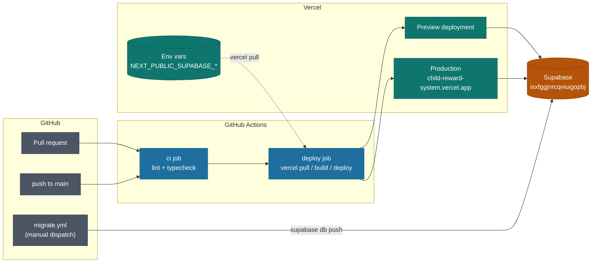

# Deployment Guide

How the Child Reward System is built, deployed, and migrated.

## How it fits together



Two independent pipelines:

- **Code** deploys automatically. Every push to `main` goes to production; every PR gets a preview URL.
- **Database** migrations are manual. Nothing in CI applies DDL on its own.

## Important: Vercel Git integration is off

The Vercel project is **not** connected to the GitHub repository. This is deliberate. If it were connected, Vercel would auto-deploy on push *and* `deploy.yml` would deploy, so every commit would build twice and race to production.

If you ever connect it in the dashboard, disable auto-deploy at the same time by adding a `vercel.json`:

```json
{ "git": { "deploymentEnabled": { "main": false } } }
```

## Prerequisites

- Node.js 22.x (pinned via `engines` in `package.json`)
- npm 10.x
- Vercel CLI 58+ (`npm i -g vercel@latest`)
- Supabase CLI (`brew install supabase/tap/supabase`)

## Environment variables

The application reads exactly two variables. Both are `NEXT_PUBLIC_*`, inlined into the client bundle at build time, and safe to expose — the anon key is only as powerful as the RLS policies in `supabase/migrations/` permit.

| Variable | Where it lives |
|---|---|
| `NEXT_PUBLIC_SUPABASE_URL` | Vercel (all 3 environments), local `.env` |
| `NEXT_PUBLIC_SUPABASE_ANON_KEY` | Vercel (all 3 environments), local `.env` |

`SUPABASE_ACCESS_TOKEN` is a CLI credential for `gen types` / `db push`. It belongs in your local `.env` and in GitHub secrets — **never** in Vercel.

Copy `.env.example` to `.env` to start locally.

### Gotcha: sensitive env vars break the build

`vercel env add` marks variables **sensitive by default**. Sensitive values cannot be read back, so `vercel pull` writes the literal string `[SENSITIVE]` instead of the value, and the build then dies with:

```
Error: Invalid supabaseUrl: Must be a valid HTTP or HTTPS URL.
Export encountered an error on /_not-found/page
```

Always pass `--no-sensitive` for the `NEXT_PUBLIC_*` pair:

```bash
vercel env add NEXT_PUBLIC_SUPABASE_URL production --no-sensitive
```

To repair existing ones, re-add with `--no-sensitive --force`, then confirm the real value comes back:

```bash
vercel pull --yes --environment=production
grep NEXT_PUBLIC_SUPABASE_URL .vercel/.env.production.local
```

## GitHub secrets

| Secret | Purpose | How to get it |
|---|---|---|
| `VERCEL_TOKEN` | Auth for the deploy job | vercel.com/account/tokens |
| `VERCEL_ORG_ID` | Target org | `.vercel/project.json` → `orgId` |
| `VERCEL_PROJECT_ID` | Target project | `.vercel/project.json` → `projectId` |
| `SUPABASE_ACCESS_TOKEN` | Migration workflow auth | supabase.com/dashboard/account/tokens |
| `SUPABASE_DB_PASSWORD` | `supabase db push` | Supabase → Settings → Database |
| `SUPABASE_PROJECT_REF` | Project to migrate | `isxfggjnrcqviuigopbj` |

The Supabase **runtime** keys are intentionally absent — `vercel pull` supplies them from the Vercel project during the build, so they never need to exist in GitHub.

```bash
printf '%s' "<value>" | gh secret set VERCEL_TOKEN
```

## Supabase auth configuration

In the dashboard under **Authentication → URL Configuration**:

- **Site URL:** `https://child-reward-system.vercel.app`
- **Redirect URLs:**
  - `https://child-reward-system.vercel.app/**`
  - `https://child-reward-system-*-nitin27mays-projects.vercel.app/**`
  - `http://localhost:3000/**`

The wildcard entry matters. `app/auth/login/page.tsx` and `app/auth/signup/page.tsx` build `redirectTo` from `window.location.origin`, so each preview deployment authenticates against its own hostname. Without the wildcard, logins work in production and fail on every preview.

`app/auth/callback/route.ts` resolves its redirect base from the `x-forwarded-host` header rather than `request.url`, because behind Vercel's proxy the latter carries the internal deployment host.

### Google OAuth (optional)

1. In [Google Cloud Console](https://console.cloud.google.com), create an OAuth 2.0 Client ID (Web application)
2. Authorized origin: `https://isxfggjnrcqviuigopbj.supabase.co`
3. Redirect URI: `https://isxfggjnrcqviuigopbj.supabase.co/auth/v1/callback`
4. Paste the Client ID and Secret into Supabase → **Authentication → Providers → Google**

Note the redirect URI points at Supabase, not at the app. Supabase then forwards to `/auth/callback` using the allow-list above.

## Database migrations

The schema lives in `supabase/migrations/`. `20260101000000_initial_schema.sql` creates 10 tables, enables RLS on all of them, and defines 22 policies plus 12 triggers. `supabase/seed.sql` adds a demo family and is applied by `supabase db reset` locally.

### Applying to the remote project

Use the **Migrate Supabase** workflow in the Actions tab. It only runs on manual dispatch:

1. Type `MIGRATE` in the confirm field
2. Leave **dry_run** checked for the first run
3. Read the migration status in the job summary
4. Re-run with dry_run unchecked to apply

Attach required reviewers to the `production` environment (Settings → Environments) if you want an approval gate.

### Gotcha: migration history drift

If a migration exists locally but is missing from the remote history, `db push` replays it against an already-populated database and fails. Check first:

```bash
supabase migration list --linked
```

If a version is applied but unrecorded, mark it:

```bash
supabase migration repair --status applied 20260101000000
```

### Local schema work

```bash
supabase migration new <name>
supabase db reset      # rebuild locally from migrations + seed.sql
supabase db push       # apply to remote once you are satisfied
```

`supabase/config.toml` pins `major_version = 17` to match the remote (17.6.1.063). Keep them in step or local behaviour diverges from production.

After any schema change, regenerate types and fix the fallout in the same change:

```bash
supabase gen types typescript --project-id isxfggjnrcqviuigopbj > types/supabase.ts
```

## Manual deploy

The workflow is the normal path, but the CLI does the same thing:

```bash
vercel pull --yes --environment=production
vercel build --prod
vercel deploy --prebuilt --prod
```

## Verifying a deploy

```bash
B=https://child-reward-system.vercel.app
curl -s -o /dev/null -w "%{http_code}\n" $B                        # 200
curl -s -o /dev/null -w "%{http_code}\n" "$B/api/v2/dashboard"     # 401, not 500
curl -s $B/sw.js | grep BUILD_ID                                   # commit SHA
```

A `500` from `/api/v2/dashboard` means the Supabase env vars did not reach the build. A `401` is correct — it proves RLS is rejecting an unauthenticated request.

## Service worker caching

`public/sw.js` is **generated** and gitignored. `scripts/build-sw.mjs` runs on `prebuild`, stamping `scripts/sw.template.js` with the commit SHA (`VERCEL_GIT_COMMIT_SHA`, falling back to `GITHUB_SHA`, then a local timestamp).

This exists because the cache names were previously fixed at `static-v1` / `dynamic-v1`. The activate handler evicts every cache whose key does not match the current names — with constant names it never evicted anything, so returning users kept an old app shell indefinitely. Edit the template, never `public/sw.js`.

## Known issues

- **~25 pre-existing lint errors** (`no-explicit-any`, `react-hooks` violations across the page components). The `lint` step in `deploy.yml` is `continue-on-error: true` until these are cleared; `typecheck` is the blocking gate. Remove that flag once lint is clean.
- **`middleware.ts` naming is deprecated** in Next.js 16 — the build warns that the convention is now `proxy`. Harmless today, will need renaming before Next 17.
- **`types/supabase.ts` is hand-written**, not CLI output, and the `Database` generic is not passed to `createBrowserClient` / `createServerClient`. Every Supabase query is therefore untyped.
